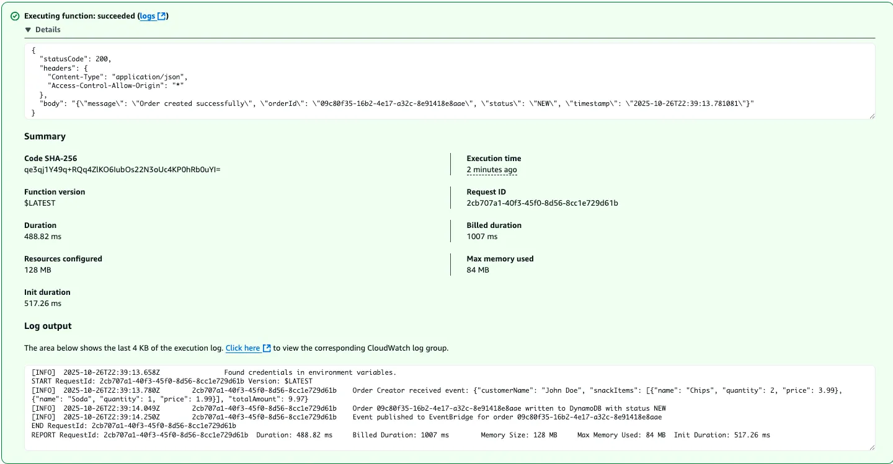
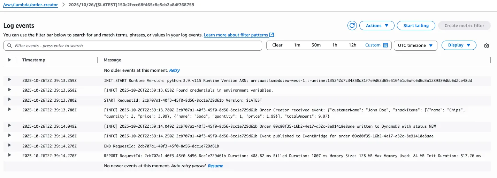
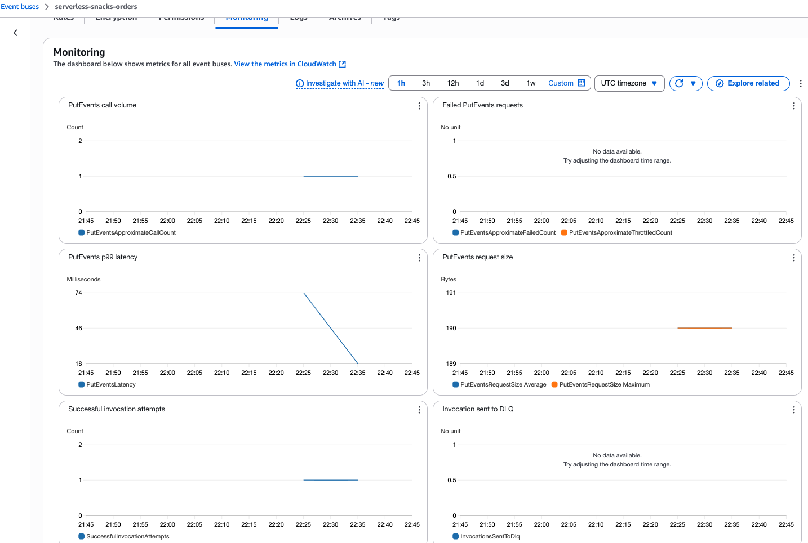
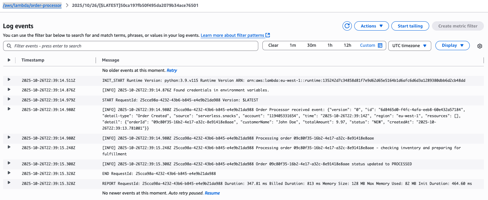
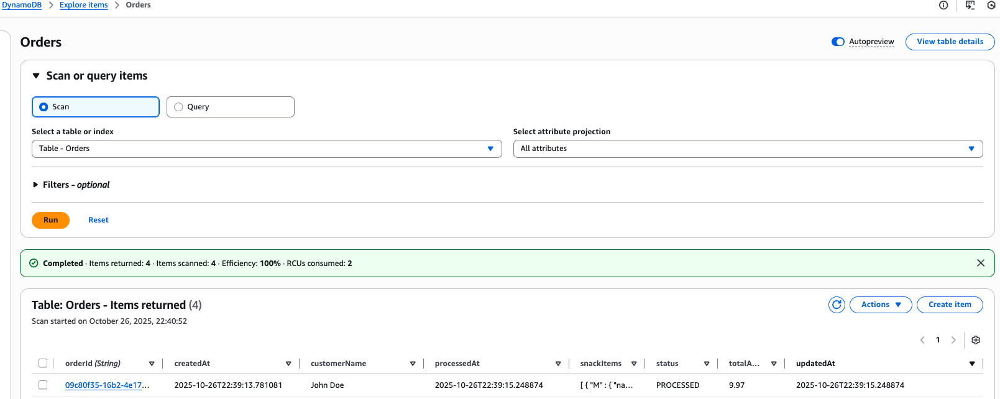
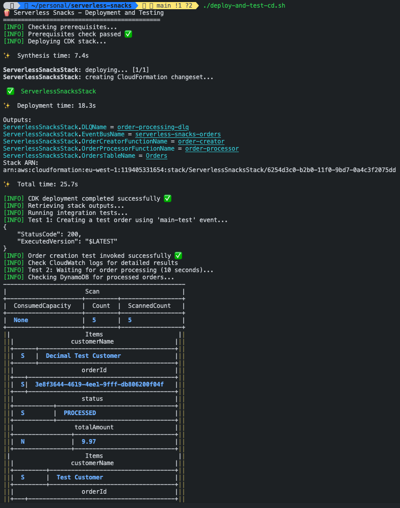
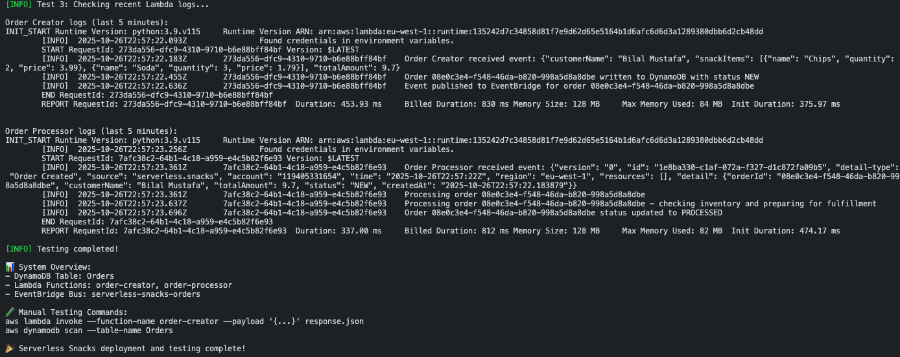

# Conclusion - Serverless Snacks Order Processing System

This document demonstrates the complete workflow of the Serverless Snacks order processing system, showcasing both the manual process flow and the automated deployment and testing capabilities.

## System Workflow Demonstration

### 1. Order Creation Process

#### Initial Order Creation

The journey begins with the **Order Creator Lambda** function receiving a JSON payload containing customer order details. This function serves as the entry point to our serverless order processing system, accepting orders with customer information, snack selections, and delivery preferences.

#### Order Persistence

Once the order is received, the Order Creator Lambda:
- Generates a unique `orderId` using UUID
- Stores the order in DynamoDB with status "NEW"
- Captures timestamp and customer information
- Prepares the order for downstream processing

### 2. Event-Driven Communication

#### EventBridge Integration

The system leverages **AWS EventBridge** to create a decoupled, event-driven architecture:
- Order Creator publishes "Order Created" events to a custom event bus (`serverless-snacks-orders`)
- Events contain order metadata and trigger downstream processing
- This pattern enables scalability and future extensibility for additional order processors
- Provides resilience through built-in retry mechanisms and dead letter queues

### 3. Order Processing

#### Order Fulfillment

The **Order Processor Lambda** is triggered by EventBridge events and handles:
- Processing the order from "NEW" to "PROCESSED" status
- Simulating order fulfillment workflows
- Updating order status in DynamoDB
- Error handling and logging for operational visibility

### 4. Data Persistence

#### DynamoDB Storage

The **DynamoDB Orders table** serves as the central data store:
- Stores complete order lifecycle from creation to processing
- Uses `orderId` as partition key for efficient lookups
- Tracks status transitions and timestamps
- Provides consistent, scalable data persistence for the serverless architecture

## Automation and Testing

### 5. Automated Deployment

#### Deployment Script Execution

The automation is achieved through the `deploy-and-test.sh` || `deploy-and-test-cd.sh` script which:
- **Infrastructure Deployment**: Uses AWS CDK to deploy the complete serverless stack
- **Dependency Management**: Installs and configures all required dependencies
- **Environment Setup**: Configures AWS resources, IAM roles, and permissions
- **Pre-deployment Validation**: Checks prerequisites and AWS credentials

#### Integration Testing

The script continues with comprehensive integration testing:
- **End-to-End Testing**: Automatically invokes the Order Creator Lambda with test payloads
- **Event Flow Validation**: Verifies that events flow correctly through EventBridge
- **Database Verification**: Confirms orders are properly stored and updated in DynamoDB
- **Status Monitoring**: Tracks order status transitions from "NEW" to "PROCESSED"
- **Cleanup Operations**: Manages test data and resources

## Key Achievements

### Technical Excellence
- **Event-Driven Architecture**: Implemented a fully decoupled system using EventBridge
- **Serverless Best Practices**: Leveraged AWS Lambda for cost-effective, scalable compute
- **Infrastructure as Code**: Used AWS CDK for reproducible, version-controlled deployments
- **Operational Monitoring**: Integrated CloudWatch logging and monitoring

### Automation Benefits
- **One-Command Deployment**: Complete infrastructure deployment with a single script execution
- **Integrated Testing**: Automated validation of the entire order processing workflow
- **Developer Experience**: Streamlined development cycle with automated testing and validation
- **Production Readiness**: Comprehensive error handling and monitoring capabilities

### Scalability and Resilience
- **Auto-scaling**: Lambda functions automatically scale based on demand
- **Error Handling**: Dead letter queues and retry mechanisms ensure message reliability
- **Decoupled Design**: Event-driven architecture enables independent scaling of components
- **Cost Optimization**: Pay-per-use serverless model optimizes operational costs

## Conclusion

The Serverless Snacks order processing system demonstrates a modern, cloud-native approach to building scalable applications. Through the combination of AWS Lambda, EventBridge, and DynamoDB, we've created a resilient, event-driven system that can handle order processing at scale.

The automation script showcases how infrastructure as code and automated testing can significantly improve the developer experience, enabling rapid iteration and reliable deployments. This approach ensures that the system is not only functional but also maintainable and production-ready.

The architecture successfully achieves the goals of:
- ✅ **Scalability**: Automatic scaling based on demand
- ✅ **Resilience**: Error handling and retry mechanisms
- ✅ **Maintainability**: Clean separation of concerns and comprehensive logging
- ✅ **Cost Efficiency**: Serverless pay-per-use model
- ✅ **Developer Productivity**: Automated deployment and testing workflows

This project serves as a solid foundation for more complex serverless applications and demonstrates the power of event-driven architectures in building modern, cloud-native systems.